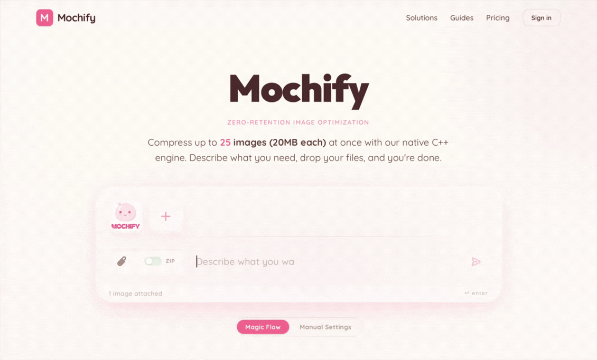

# Mochify Frontend

**Privacy-First • Hardware-Hardened • Green C++ Engine**

    



Mochify is a high-performance image processing utility. Unlike traditional cloud converters that buffer images to disk, Mochify uses a **stateless C++ engine** to ensure your pixels never touch permanent storage.

**[Launch App →](https://mochify.xyz)**

---

## Privacy Model

This frontend is open-source so you can verify exactly how your data is handled before it leaves your browser.

* **Public UI (SvelteKit + Cloudflare):** Auditable code. No hidden trackers. No third-party ad networks.
* **Private Vault (C++):** A proprietary, hardware-locked engine running on native Linux kernel primitives to guarantee data volatility.

### Security Hardening

* **Volatile RAM only:** Temporary file creation is disabled and container swap is off — images are buffered in volatile RAM and wiped on request completion.
* **Zero-buffer streaming:** Data streams directly from the TLS connection into the C++ process; no intermediate disk writes.
* **Strict CSP:** A rigid `connect-src` policy prevents the browser from sending data to any domain outside our verified API.

### Analytics

We use **self-hosted [Umami](https://umami.is)** — cookie-free, GDPR-compliant, and anonymized. No data is shared with Google, Facebook, or any ad networks.

---

## Performance

Built with native C++ and `libvips`, ditching heavy interpreted runtimes for real gains:

* **Energy efficient:** Native code uses a fraction of the electricity per megapixel compared to Python/Node.js-based APIs.
* **Low latency:** Average processing time ~822ms, with disk I/O eliminated as a bottleneck.

---

## Developing

**Stack:** Svelte 5, TailwindCSS v4, Cloudflare Pages adapter.

**Prerequisites:** Node.js 20+

```bash
git clone https://github.com/tliesnham/mochify-frontend.git
cd mochify-frontend
npm install
```

Copy `.env.example` to `.env`:

```env
PUBLIC_API_URL=http://localhost:3000
```

> **Note:** The production API (`api.mochify.xyz`) enforces strict CORS/Referrer checks and will reject requests from `localhost`. Point `PUBLIC_API_URL` at a local mock server for development.

```bash
npm run dev          # start dev server
npm run build        # production build
npm run check        # type-check
npm run lint         # lint + format check
```

## Self-Hosting

The **Mochify Lite** engine is available as a hardened Docker image with the same RAM-only, zero-persistence config used in production. Multi-arch: `amd64` and `arm64` (Apple Silicon / AWS Graviton).

**Docker Hub:** [mochify/mochify-lite](https://hub.docker.com/r/mochify/mochify-lite)

```bash
docker pull mochify/mochify-lite:latest
