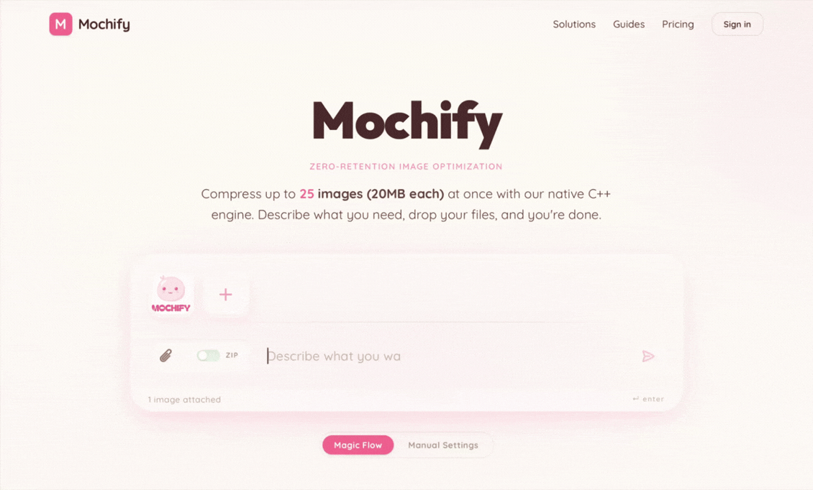

# Mochify Frontend

**Privacy-First • Hardware-Hardened • Green C++ Engine**

     [](https://smithery.ai/servers/mochify/mochify) [](https://theresanaiforthat.com/ai/mochify/?ref=featured&v=10637185)



Mochify is a high-performance media processing utility for **images, PDFs and video**. Unlike traditional cloud converters that buffer uploads to disk, Mochify uses a **stateless C++ engine** to ensure your pixels never touch permanent storage.

**[Launch App →](https://mochify.app)**

---

## What it does

### Images

Convert and compress between **JPG, PNG, WebP, AVIF and JPEG XL**, with **HEIC/HEIF/HIF** and **SVG** accepted as input. Resize, rotate, crop, strip EXIF, and remove backgrounds. Saliency-guided smart compression picks a quality per image rather than applying one number to everything, and smart crop centres on the detected subject instead of the geometric middle.

Describe what you want in plain English (*"convert to WebP and AVIF at 1200px, strip the metadata"*) and Magic Flow maps it to parameters, or use the classic form if you would rather set them yourself.

### PDFs

A full PDF toolkit at `POST /v1/pdf`:

| Operation | What it does |
| --- | --- |
| `optimize` | Recompress the images **inside** a PDF, in place. Text, fonts, vector art, links and layout are untouched, so the document stays searchable. |
| `extract` | Pull the embedded images out at the resolution they were stored at. Not a render of each page: the actual pictures somebody placed in the document. |
| `rasterize` | Render every page to an image. |
| `split` | Explode a PDF into one single-page PDF per page. |
| `create` | Build a PDF from images, one page per image. |

`optimize` targets resolution against how large each image is actually *drawn* on the page, read from the content stream, rather than how many pixels it happens to store. A 4000px photo dropped into a two-inch box is 2000 DPI of waste; the same photo full-bleed on A4 is not, and only the drawn size tells them apart. Images it cannot confidently handle are passed through byte-for-byte rather than dropped, and it never returns a file larger than the one you gave it.

### Video and audio

MP4, WebM, MKV and MOV conversion plus audio extraction, running **entirely in your browser** via [MediaBunny](https://mediabunny.dev). This is the one part of Mochify that is genuinely client-side: the file never leaves your machine, and the server never sees it.

### Save to your own storage

Results can be written straight into your own **S3 / R2 / S3-compatible bucket** or **Google Drive** instead of downloading. The bytes go from Mochify to your storage directly rather than back through the browser.

---

## Privacy Model

This frontend is open-source so you can verify exactly how your data is handled before it leaves your browser.

* **Public UI (SvelteKit + Cloudflare):** Auditable code. No hidden trackers. No third-party ad networks.
* **Private Vault (C++):** A proprietary, hardware-locked engine running on native Linux kernel primitives to guarantee data volatility.

### Security Hardening

* **Volatile RAM only:** Temporary file creation is disabled and container swap is off — images are buffered in volatile RAM and wiped on request completion.
* **Zero-buffer streaming:** Data streams directly from the TLS connection into the C++ process; no intermediate disk writes.
* **Strict CSP:** A rigid `connect-src` policy prevents the browser from sending data to any domain outside our verified API.

### Analytics

We use **self-hosted [Umami](https://umami.is)** — cookie-free, GDPR-compliant, and anonymized. No data is shared with Google, Facebook, or any ad networks.

---

## AI & MCP Integration

Mochify exposes a hosted [Model Context Protocol](https://modelcontextprotocol.io) server at `mcp.mochify.app`, letting AI agents compress and convert images directly without any manual tooling.

**Add to Claude.ai or any MCP-compatible client:**

```
https://mcp.mochify.app
```

**Or install via Smithery:**

[](https://smithery.ai/servers/mochify/mochify)

Auth is handled via OAuth — no API key configuration required. The `squish` tool accepts a public image URL plus optional format, dimensions, and quality parameters.

For CLI and local MCP use, see [mochify-cli](https://github.com/tliesnham/mochify-cli).

**REST API:** full parameter reference, response headers and cURL / JavaScript / Python examples at **[mochify.app/docs](https://mochify.app/docs)**. A machine-readable summary for agents lives at [mochify.app/llms.txt](https://mochify.app/llms.txt).

---

## Performance

Built with native C++ and `libvips`, ditching heavy interpreted runtimes for real gains:

* **Energy efficient:** Native code uses a fraction of the electricity per megapixel compared to Python/Node.js-based APIs.
* **Low latency:** Average processing time ~822ms, with disk I/O eliminated as a bottleneck.

---

## Developing

**Stack:** Svelte 5, TailwindCSS v4, Cloudflare Pages adapter.

**Prerequisites:** Node.js 20+

```bash
git clone https://github.com/tliesnham/mochify-frontend.git
cd mochify-frontend
npm install
```

Copy `.env.example` to `.env`:

```env
PUBLIC_API_URL=http://localhost
```

> **Note:** The production API (`api.mochify.app`) enforces strict CORS/Referrer checks and will reject requests from `localhost`. Point `PUBLIC_API_URL` at a local instance of mochify-core for development.

```bash
npm run dev          # start dev server
npm run build        # production build
npm run check        # type-check
npm run lint         # lint + format check
```

## Self-Hosting

The core engine is available as a hardened Docker image with the same RAM-only, zero-persistence config used in production. Multi-arch: `amd64` and `arm64` (Apple Silicon / AWS Graviton).

**Docker Hub:** [mochify/mochify-lite](https://hub.docker.com/r/mochify/mochify-lite)

```bash
docker pull mochify/mochify-lite:latest
```
